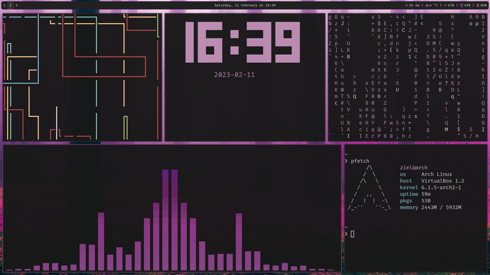

# Dotfiles

A *"pink rice"* - collection of dotfiles I did

## Screenshot

## Main Tools

- **Operating System** - **[Arch Linux](https://archlinux.org/)**

- Window Manager - [i3](https://i3wm.org/)
- Terminal Emulator - [Alacritty](https://alacritty.org/)
- Compositor - [Picom](https://github.com/yshui/picom)
- Browser - [Brave](https://brave.com/)
- File Manager - [Thunar](https://wiki.archlinux.org/title/Thunar)
- Screenshots - [Flameshot](https://flameshot.org/)

## Tools on Screenshot

- Pipes Animation - [pipes.sh](https://github.com/pipeseroni/pipes.sh)
- Terminal Clock - [TTY-Clock](https://github.com/xorg62/tty-clock)
- Matrix Animation - [Cmatrix](https://github.com/abishekvashok/cmatrix)
- Audio Visualizer - [Cava](https://github.com/karlstav/cava)
- System Fetch Utility - [pfetch](https://github.com/dylanaraps/pfetch)

## License

This repo is under the [MIT](./LICENSE) License.

## TODO

- [ ] - Find a way to customize lightdm-(gtk)-greeter
